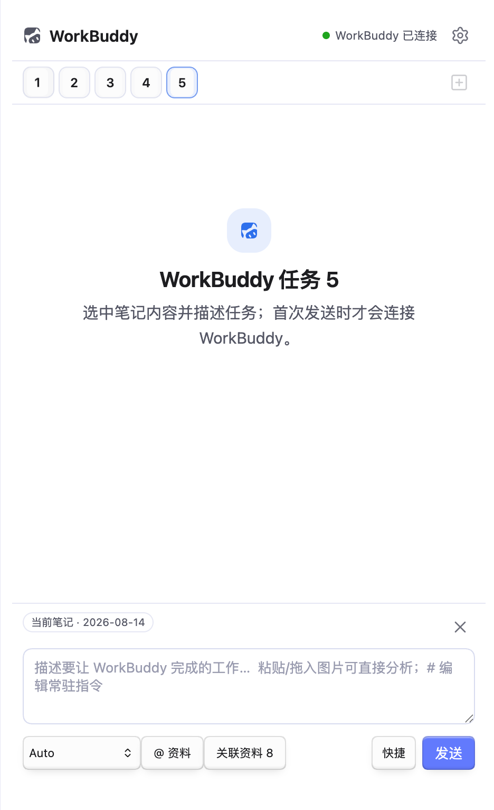

# WorkBuddy for Obsidian

在 Obsidian 桌面端侧边栏中接入本机 WorkBuddy，把笔记选区、项目资料和本地文件直接交给 AI 搜索、分析与处理。

> 非官方社区插件。本项目与 Obsidian、腾讯及 WorkBuddy 官方不存在隶属或背书关系；WorkBuddy 等名称与标识归其各自权利人所有。

<p align="center">
  
</p>

## 功能亮点

- 最多 5 个相互独立的任务页，可切换、重命名、关闭和恢复。
- 自动捕获选区文字，在右侧显示引用的文字，实现对局部文字的提问、优化，确认后可一键替换原选区并先看 Diff。
- 在输入框粘贴或拖入图片，直接随消息交给模型分析。
- `@` 引用笔记、文件夹、标签、标题段落、PDF、图片及其他 Vault 文件。
- “上传本地文件”支持系统多选，复制到 `WorkBuddy/Uploads/` 后加入当前任务。
- 回答底部展示可点击的 Vault 与网页来源，回答正文里的文件名也会自动转成可点击链接。
- 发送键在工作时变为红色停止按钮，支持中途打断，停止位置会标记“已停止”。
- 根据双链、反向链接、标签、标题和目录结构推荐关联笔记。
- 选区右键支持润色、总结、缩写、扩写、转表格和生成汇报提纲。
- 右下角“快捷”面板内置正式润色、口语润色、一键翻译、代码审查、笔记整理等指令，可在设置页自定义。
- 左下角模型选择器：默认 Auto 跟随 WorkBuddy，可手动切换；同时支持通过 `session/setConfigOption` 实时换模型，不重启 CLI。
- 常驻指令（人设）：在输入框输入 `#` 即可编辑，每次发送自动拼接。
- `/` 通用工作模板内置会议纪要、内容润色、汇报提纲、案例总结和执行方案。
- 自动保存聊天恢复态；支持历史全文搜索、重要回答收藏、选择性保存和完整 Markdown 导出。
- 可配置主题色，自定义 `Auto` 默认选中行为与更多细节。
- 可配置 GitHub Release 更新源，支持检查、校验、备份和一键安装。

## 工作方式与安全边界

插件通过本机 `codebuddy --acp` 启动私有 stdio 子进程：

- 不开放本地 HTTP 端口。
- 不保存模型 API Key。
- 打开侧边栏时不会连接 WorkBuddy，首次发送任务时才启动 CLI。
- 涉及写文件、执行命令等副作用时，继续使用 WorkBuddy 权限确认。
- 本地文件上传是“复制进 Vault”，不会移动或修改电脑上的原文件。

更多说明见 [PRIVACY.md](PRIVACY.md) 与 [SECURITY.md](SECURITY.md)。

## 前置条件

- Obsidian 桌面版 1.7.2 或更高版本。
- Node.js 18 或更高版本。
- 已安装并登录 WorkBuddy CLI。

```bash
npm install -g @tencent-ai/codebuddy-code
codebuddy --version
codebuddy
```

首次运行 `codebuddy` 时请按终端提示完成登录；进入交互界面后可按 `Ctrl+C` 退出。

## 安装

### 从 GitHub Release 安装

1. 打开仓库的 **Releases** 页面，下载最新版本 ZIP。
2. 解压到 `<你的知识库>/.obsidian/plugins/workbuddy-for-obsidian/`。
3. 确认目录中至少包含 `main.js`、`manifest.json`、`styles.css`。
4. 在 Obsidian → 设置 → 第三方插件中启用 **WorkBuddy for Obsidian**。

### 从源码构建

```bash
git clone https://github.com/bigbay957-sudo/workbuddy-for-obsidian.git
cd workbuddy-for-obsidian
npm install
npm run verify
```

然后把 `main.js`、`manifest.json`、`styles.css` 复制到插件目录。

> 当前尚未提交 Obsidian 社区插件市场，请勿把“可从 GitHub 安装”理解为已经获得 Obsidian 官方审核。

## 快速使用

### 选区工作

1. 在左侧笔记中选中文字、列表、表格源码或代码块。
2. 右侧引用卡片会显示被引用的原文。
3. 输入工作要求并发送。
4. 回复后可复制、插入、保存为笔记，或先查看 Diff 再替换原选区。

### 添加资料与上传文件

- 在输入框中键入 `@`，或点击“@ 添加资料”。
- 列表第一项“上传本地文件”可一次选择多个电脑文件。
- 文件复制到 `WorkBuddy/Uploads/`；同名文件自动增加序号，单个文件上限 200MB。
- 其他选项可引用 Vault 内的笔记、文件夹、标签、标题、PDF 和图片。

### 多任务与聊天记录

- 点击顶部“+”增加任务，最多同时打开 5 个。
- 双击任务名称可重命名。
- 在任务标签上点击右键，可保存聊天、打开任务历史或关闭任务。
- 历史记录支持搜索、恢复和完整导出；回答下方星标可收藏重要结果。

### 关联资料

- “关联资料”完全在本地按链接、标签、标题和目录评分，不上传 Vault 建立外部索引。
- 每次发送任务前自动刷新条目数，可在右侧直接插入到当前消息。

### 模型与人设

- 左下角模型下拉默认显示 **Auto**，与 WorkBuddy 的 auto 模式对齐；手动选过的模型会被记住。
- 右上角设置按钮的二级菜单里可编辑人设（常驻指令），输入框输入 `#` 也能快速打开同一编辑器。

## 设置

- **WorkBuddy CLI 路径**：留空自动检测，也可填写完整路径。
- **模型**：留空使用 WorkBuddy 默认模型。
- **权限模式**：推荐 `default`，插件不会启用 `bypassPermissions`。
- **自动附加当前笔记 / 优先附加选区**：控制默认上下文。
- **上下文字符上限**：控制单次发送的文本量。
- **GitHub 更新仓库**：填写 `owner/repository` 后可检查 Release 更新。

## 开发与验证

```bash
npm install
npm run typecheck
npm test
npm run build
npm run probe
```

完整质量门：`npm run verify`

发布标签必须与 `manifest.json` 版本一致。仓库内的 GitHub Actions 会构建并上传标准三文件与安装 ZIP。

## 常见问题

- **找不到 CLI**：在插件设置中填写完整路径；macOS npm 全局安装通常位于 `~/.local/bin/codebuddy`。
- **无法连接**：先在终端运行一次 `codebuddy`，确认已经登录。
- **修改 CLI 路径、模型或权限后未生效**：关闭并重新打开 WorkBuddy 侧边栏，或重新加载插件。
- **本地文件上传失败**：确认使用 Obsidian 桌面版，并检查 Vault 是否可写。

## 路线与反馈

- 版本变化见 [CHANGELOG.md](CHANGELOG.md)。
- Bug 与功能建议请通过 GitHub Issues 提交。
- 贡献代码前请阅读 [CONTRIBUTING.md](CONTRIBUTING.md)。

## License

[MIT](LICENSE)
